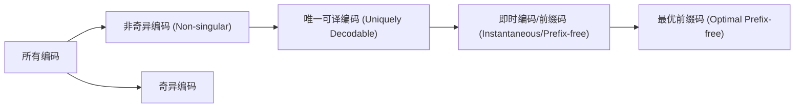

# 深度学习笔记：信源编码理论（基于廉黎祥《通信原理》第10周课堂）

> **课程信息**  
> 教师：廉黎祥  
> 课程名称：通信原理  
> 时间：2025年11月21日（第10周）  
> 地点：上海科技大学创管学院215教室  

---

## 一、课程介绍与核心目标

本节课系统讲解了**数字通信系统中的信源编解码**，重点聚焦于如何将离散信源高效地表示为二进制比特流。课程不仅涵盖技术定义和公式推导，更深入剖析了编码设计的**思想脉络、历史背景与工程实践考量**。

### 核心教学目标
1. **唯一可译性（Uniquely Decodable）**：确保接收端能无歧义地还原原始符号序列。  
2. **信源压缩（Source Compression）**：最小化平均码字长度 $\bar{L}$，提升传输效率。

> 🎯 **教授点拨**  
> “我们不是在‘发明’编码规则，而是在寻找信息表达的最优边界——这正是信息论的魅力所在。”  
> —— 廉黎祥老师强调，信源编码的本质是探索**信息熵所决定的极限性能**，而非简单构造编码表。

---

## 二、基本假设：离散无记忆信源（DMS）

要进行有效的信源编码分析，必须对信源建立数学模型。本课采用的标准模型是**离散无记忆信源（Discrete Memoryless Source, DMS）**。

### 定义与三大特性

根据PPT图3及语音稿内容，DMS满足以下三个条件：

1. **离散性（Discreteness）**  
   每个输出符号 $X_k$ 来自一个有限集合 $\mathcal{X}$，称为**信源字母表（Source Alphabet）**，其大小记为 $M = |\mathcal{X}|$。

2. **同分布性（Identically Distributed）**  
   所有符号 $X_k$ 都服从相同的概率分布 $P_X(x)$，即：
   $$
   P(X_k = x) = P_X(x),\quad \forall k
   $$

3. **无记忆性 / 独立性（Memoryless / Independent）**  
   不同时刻的符号之间相互独立：
   $$
   P(X_1, X_2, ..., X_n) = \prod_{i=1}^n P_X(X_i)
   $$
   即没有“上下文依赖”，每个符号都是“从头开始”的随机选择。

> ✅ **纠错说明**  
> 语音中多次出现“离散无际忆性缘”、“discre secret”等明显转录错误，已根据上下文及专业术语修正为“**离散无记忆信源（DMS）**”。

> 💡 **发展脉络**  
> DMS 是香农信息论的基础建模工具。虽然现实语言（如中文、英文）具有强相关性和上下文依赖（即“有记忆”），但 DMS 提供了一个理想的起点，使我们可以先理解最基础的信息压缩极限，再逐步引入马尔可夫信源、通用编码等复杂模型。

---

## 三、编码过程的形式化描述

信源编码可视为一个**映射函数** $C: \mathcal{X} \to \{0,1\}^*$，即将每个符号 $x \in \mathcal{X}$ 映射到一个由0和1组成的**码字（Codeword）**。

### 关键概念定义（结合PPT图4）

| 概念 | 符号 | 含义 |
|------|------|------|
| 码字长度 | $l(x)$ | 编码后得到的二进制位数（bit） |
| 平均码长 | $\bar{L}$ | $\mathbb{E}[l(X)] = \sum_{x \in \mathcal{X}} P_X(x) l(x)$，单位：bit/symbol |
| 编码速率 | $R$ | 即 $\bar{L}$，衡量每符号输出多少比特 |

> 🔍 **深入理解**  
> $\bar{L}$ 是一个期望值，它综合了符号的出现概率与其编码长度。高频符号即使只节省1 bit，也可能比低频符号节省10 bit 对整体压缩效果贡献更大。

---

## 四、两种基本编码方式

### 1. 定长编码（Fixed-Length Code）

#### 原理
将信源字母表中的每一个符号都编码成相同长度 $L$ 的二进制码字。

#### 唯一可译性条件
为了保证不同符号对应不同的码字，需满足：
$$
2^L \geq M
\Rightarrow L \geq \lceil \log_2 M \rceil
$$
其中 $\lceil \cdot \rceil$ 表示向上取整。

#### 最小编码长度
$$
L_{\min} = \lceil \log_2 M \rceil
$$
当且仅当 $M = 2^n$（如4, 8, 16）时，$\log_2 M$ 为整数，此时 $L_{min} = \log_2 M$。

> 📘 **实例解析（PPT图6）**  
> 若信源有6个符号（A–F），则 $M=6$，$\log_2 6 \approx 2.58$，故 $L_{\min} = 3$。可用3位二进制码（000～101）分别表示各符号。

> 💬 **趣闻与实例**  
> ASCII码（PPT图7）就是典型的定长编码！每个字符用8位表示，共支持256种字符。尽管效率不高（很多字符很少使用），但它结构简单、易于硬件实现，至今仍是计算机系统的基石之一。

---

### 2. 定长到定长编码（Block Fixed-to-Fixed Code）

#### 思想升级
不单独编码单个符号，而是将**连续的 $n$ 个符号**组成一个“超级符号”（$n$-tuple），然后对该超级符号进行定长编码。

#### 参数关系
- 超级符号总数：$M^n$
- 所需码字长度 $L$ 满足：$2^L \geq M^n \Rightarrow L \geq \lceil n \log_2 M \rceil$
- 每个原始符号的平均编码长度为：
  $$
  \frac{L}{n} \geq \frac{\lceil n \log_2 M \rceil}{n}
  $$

> Q：但这种定长到定长的编码方式是否意味着：延迟增加，或者说实时性降低，编解码效率降低？
> A：应该平均编解码速度是差不多的，但是实时性会减弱。

#### 渐近最优性
当 $n \to \infty$ 时，
$$
\frac{L}{n} \to \log_2 M
$$
这意味着，通过增大分组长度，可以无限逼近理论下界 $\log_2 M$，**即使 $M$ 不是2的幂**！

> 🧠 **思路与方法**  
> 这体现了“大数定律”在编码中的应用：个体差异被群体统计规律所平滑。虽然实际中受限于延迟和存储，无法做到 $n=\infty$，但该思想启发了现代压缩算法（如LZ77）中滑动窗口的设计。

---

## 五、变长编码（Variable-Length Code）

### 动机：打破“等价对待”
定长编码隐含假设所有符号等概出现，但在现实中，某些符号（如英语中的'e'）远比其他符号（如'z'）频繁。**能否让高频符号用短码，低频符号用长码？**

答案是肯定的——这就是**变长编码**的核心思想。

### 示例（PPT图9）
设信源符号集为 {A, B, C}，概率分别为 $P(A)=1/2$, $P(B)=1/4$, $P(C)=1/4$。

设计如下编码：
- A → `0` （长度1）
- B → `10`（长度2）
- C → `11`（长度2）

计算平均码长：
$$
\bar{L} = \frac{1}{2}\cdot1 + \frac{1}{4}\cdot2 + \frac{1}{4}\cdot2 = 1.5 \text{ bit/symbol}
$$
而定长编码需至少2 bit/symbol，可见显著提升效率。

> ⚠️ **关键挑战（PPT图9 & 图10）**
>
> 变长编码带来两个新问题：
> 1. **解析歧义性**：接收到比特流如 `01011...`，如何知道 `0` 是A，还是 `01` 是某个码字的一部分？
> 2. **输出速率不恒定**：输入固定速率，但输出比特率波动，需缓冲器管理，可能溢出或空闲。

---

## 六、编码分类体系：从奇异到最优

### 层级结构（PPT图11 & 图12）

#### 逐层解读
1. **非奇异编码（Non-singular）**  
   不同符号对应不同码字。这是唯一可译的前提，否则直接冲突。

2. **唯一可译编码（Uniquely Decodable）**  
   任意符号序列的拼接码字在整个码集中唯一。例如：
   - ✅ 前缀码一定是唯一可译的。
   - ❌ 如 A→`0`, B→`01`，则序列 `01` 可解释为B或A+A+...，存在歧义。

3. **即时编码 / 前缀码（Instantaneous / Prefix-free Code）**  
   任何码字都不是另一个码字的前缀。这种编码可以在接收到最后一个比特时立即解码，无需等待后续比特。

> 🔍 **经验提醒**  
> “你收到一个比特流，如果还得往后看才能确定前面怎么解，那这个系统就慢了！”  
> —— 廉老师指出，**即时性**对于实时通信至关重要，避免了解码延迟。

> SELF：
> - 奇异码就是单个码的映射不是单射，
> - 非奇异码就是单个码的映射是单射，但序列不一定是单射
> - 唯一可译码就是序列是单射，
> - 即时码就是我拿到一个序列，我可以立即解码出 现在对应的符号，不管后面是什么序列，也就是任何码字不是另一个码字的前缀。

---

## 七、前缀码的树形表示法（Binary Tree Representation）

### 核心思想（PPT图14 & 图15）
前缀码可以用一棵**二叉树**直观表示：

> **SELF**；起始点是空点，下面第一层是最左边的位置，每个位置代表一个码字。
> 立即码的码树中，如果一个码路径被使用了，那么其就不再向下生长；即，所有使用的码都是最终的叶子节点，不能使用中间节点

- **根节点（Root）**：起始点  
- **分支（Branches）**：左支标`0`，右支标`1`  
- **叶子节点（Leaf Nodes）**：代表完整的码字  
- **中间节点（Internal Nodes）**：不代表任何码字  

> ✅ **重要结论**  
> 前缀码的所有码字必须对应**叶子节点**，不能是中间节点，否则会成为其他码字的前缀。

> 🎨 **图示理解**（文字描述PPT图14）  
> 例如：
> - a → `0`（左叶）  
> - b → `11`（右→右叶）  
> - c → `101`（右→左→右叶）  
> 解码时从根出发，按比特走路径，到达叶子即完成解码。

---

## 八、克拉夫特不等式（Kraft Inequality）：存在性的判据

### 数学形式（PPT图17）
对于任意一组码字长度 $\{l(x)\}_{x \in \mathcal{X}}$，若存在一个前缀码（prefix-free）使其成立，则必满足：
$$
\sum_{x \in \mathcal{X}} 2^{-l(x)} \leq 1
$$
此即**克拉夫特不等式**。

> **SELF**：
> 这里的 $\{l(x)\}_{x \in \mathcal{X}}$ 应该是一个元组，而不是一个集合，相同的长度不能合并，而是需要遍历。

### 三大用途
1. **必要条件验证**：若给定编码不满足该式，则一定不是前缀码。  
2. **存在性判断**：若满足该式，则**存在**一种前缀码实现这些长度。  
3. **完备性判据**：若等号成立（=1），则该前缀码是**满的（Complete）**，即不能再添加任何新码字而不破坏前缀性质。

> 🔢 **实例分析（PPT图18）**

| 长度组合 | 计算 $\sum 2^{-l(x)}$ | 是否可行 | 类型 |
|----------|------------------------|-----------|------|
| (1,1,2,2) | $2^{-1}+2^{-1}+2^{-2}+2^{-2} = 1.5 > 1$ | ❌ 否 | — |
| (2,2,2,2) | $4 \times 2^{-2} = 1$ | ✅ 是 | 满前缀码 |
| (2,2,3,3) | $2 \times 2^{-2} + 2 \times 2^{-3} = 0.75 < 1$ | ✅ 是 | 非满前缀码 |

> 📌 **教授点拨**  
> “Kraft不等式告诉你的是**可能性空间**，而不是具体怎么构造。它是设计前的‘可行性报告’。”

---

## 九、最优编码与哈夫曼编码（Huffman Coding）

### 什么是“最优”？
一个编码方案 $C$ 是**最优的**，当且仅当：
1. 它是唯一可译的；  
2. 其平均码长 $\bar{L}$ 在所有唯一可译码中达到最小，即 $\bar{L} = \min \bar{L}_{\text{ud}}$。

> ⚠️ **常见误区澄清**：
> - ❌ 所有前缀码都是最优的？ → 错！只是其中一部分可能是。  
> - ❌ 所有最优码都是前缀码？ → 错！存在非前缀的最优码，但前缀码已足够好且易实现。  
> - ❌ 最优前缀码只有哈夫曼码？ → 错！哈夫曼码只是众多最优前缀码中的一种。

> SELF：**哈夫曼编码是一种最优前缀码**，其目标是最小化平均码长。

### 哈夫曼编码的地位（PPT图12）
哈夫曼编码是一种**系统化的、贪婪式的最优前缀码构造算法**，具有以下优点：
- 实现简单，适合编程；  
- 达到所有前缀码中的最小平均长度；  
- 构造过程直观：合并概率最小的两个节点，层层上溯。

> 🔄 **方法论启示**  
> 哈夫曼算法体现了“局部最优导致全局最优”的思想。虽然每次只考虑当前最小概率的两个符号，但最终结果却达到了理论最优。

---

## 十、总结与展望：编码的极限在哪里？

### 理论极限：信息熵
本节课虽未直接讲出，但贯穿始终的思想是——**最优平均码长的下界就是信源的熵 $H(X)$**：
$$
H(X) \leq \bar{L}_{\min} < H(X) + 1
$$
哈夫曼编码通常非常接近这个极限。

> 🔭 **未来方向预告**：
> - 下节课将正式引入**香农第一定理（无噪信源编码定理）**，严格证明上述界限。  
> - 将探讨更高级的编码方法，如算术编码（突破整数比特限制）、Lempel-Ziv算法（无需先验概率）等。

---

## 附录：作业与练习建议

### 已发布任务
1. **提交考试前作业**：请按时完成并提交。  
2. **新作业**：
   - 信息论基础概念练习；  
   - 两道关于编码唯一性和Kraft不等式的题目。

> 📝 **教授建议**  
> “这些题看起来琐碎，但计算都很简单。关键是**提前动手**，不要等到最后一刻。尤其是Kraft不等式的应用，一定要亲手算几遍，形成直觉。”

---

> **结语**  
> 本次课程从摩尔斯电码的历史案例出发（PPT图1），经由定长、变长编码的演进，最终抵达以哈夫曼码为代表的现代编码思想，完整展现了人类追求高效信息表达的智慧历程。记住：好的编码不仅是数学游戏，更是对信息本质的深刻洞察。